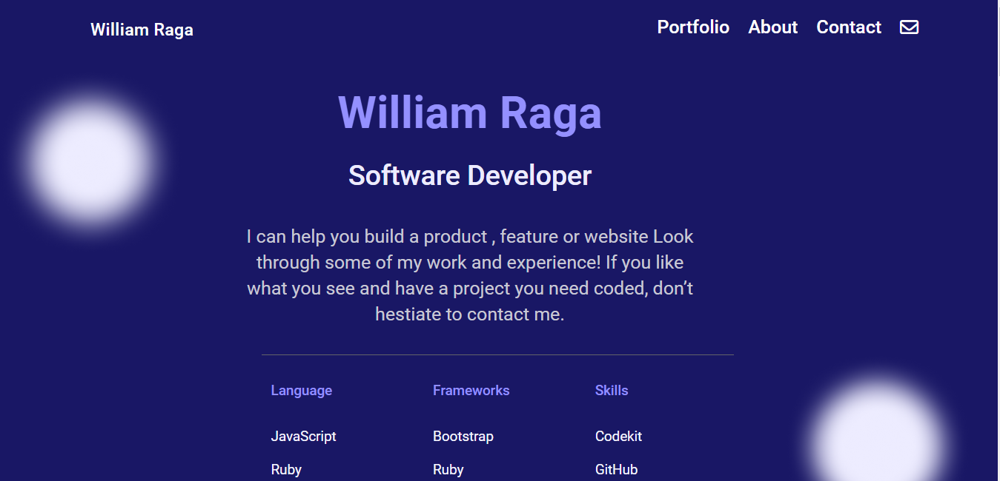

# William-Raga-Portfolio

My first Portfolio project built with HTML, CSS and JavaScript.

## Built with

- HTML
- CSS

## Setup for Basic HTML/CSS Project

- Linter for HTML/CSS installed

## Getting Started

- ### Mobile Version

- ### Desktop Version

### Prerequisites

- Text editor
- Basic HTML/CSS Knowledge
- JavaScript
- Linters i.e. Webhint, stylelint and lighthouse
- Git

### Setup

### Install

### Usage

### Deployment

- [Linter](https://github.com/microverseinc/linters-config/tree/master/html-css)

- [View Live Page Here](https://itsmraga-hub.github.io/William-Raga-Portfolio/)

## Authors

👤 **Author1**

- GitHub: [@itsmraga-hub](https://github.com/itsmraga-hub)

- Twitter: [@RagaMacharia](https://twitter.com/RagaMacharia)

- Linkedin: [@itsmraga](https://www.linkedin.com/in/itsmraga/)

👤 **Contributor1**

- GitHub: [@skyv](https://github.com/skyv26)

- Linekdin: [Aakash Verma](https://www.linkedin.com/in/devaakash/)

## 🤝 Contributing

Contributions, issues, and feature requests are welcome!

Feel free to check the [issues page](../../issues/).

## Show your support

Give a ⭐️ if you like this project!

## Acknowledgments

- Microverse team
- Inspiration

## License

- [MIT](https://github.com/itsmraga-hub/William-Raga-Portfolio/blob/master/LICENSE)
